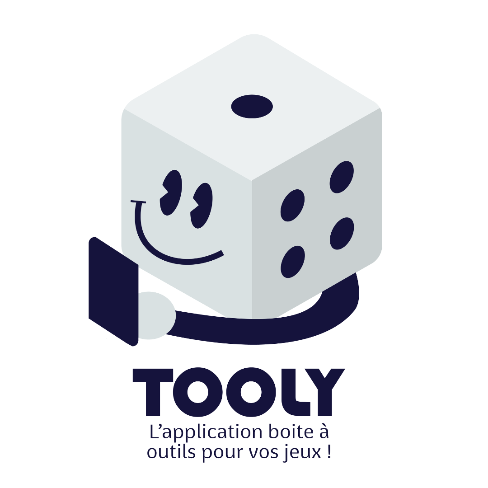

# Tooly Game


<p align="center">
  
</p>

## Description

Application mobile utilitaire pour jeux de société, Elle permet pour l'instant : 
 - De compter les scores de plusieurs joueurs lors d'une partie
 - De lancer un dé

## Environnement Technique

- React Native
- Expo
- TypeScript
- React Native Paper
- Redux Toolkit

## Installation

Assurez-vous d'avoir Node.js et Expo CLI installés sur votre machine. Ensuite, suivez les étapes ci-dessous :

1. Clonez ce dépôt :

```bash
git clone https://github.com/votre_utilisateur/nom-du-depot.git
```
Installez les dépendances du projet :
```bash
cd nom-du-depot
npm install
```
## Utilisation en développement
Pour lancer l'application en mode développement, exécutez la commande suivante :

```bash
npx expo start
```
Cela lancera le serveur de développement Expo, et vous pourrez utiliser l'application en scannant le code QR avec l'application Expo Go sur votre appareil mobile ou en utilisant un émulateur/simulateur.

## Réalisation d'un Build
Pour créer une version de production de l'application, utilisez la commande suivante :

```bash
expo build:[android/ios]
```
Suivez les instructions pour générer un build pour Android ou iOS. Vous pouvez ensuite soumettre le build généré aux magasins d'applications respectifs.

## Contributeurs
- GRANDVAUX Clément (Développeur): [GitHub](https://github.com/GrandvauxClement) / [Site perso](https://www.clementgrandvaux.fr/)
- ZettyDesign (Designer): [Site Perso](https://www.zettydesign.fr/)
## Contributions
Les contributions sont les bienvenues ! Si vous souhaitez contribuer à l'application, suivez ces étapes :

1) Clonez le dépôt :

```bash
git clone https://github.com/votre_utilisateur/nom-du-depot.git
```
2) Créez une branche pour vos modifications :
```bash
git checkout -b nom-de-votre-branche
```
3) Effectuez les modifications et committez-les :

3) Poussez vos modifications vers GitHub :
4) Ouvrez une Pull Request sur GitHub et décrivez vos modifications en détail.
Nous apprécions toutes les contributions, qu'elles soient grandes ou petites !

License
Indiquez ici la licence de votre choix pour votre application.

© Année - Votre Nom